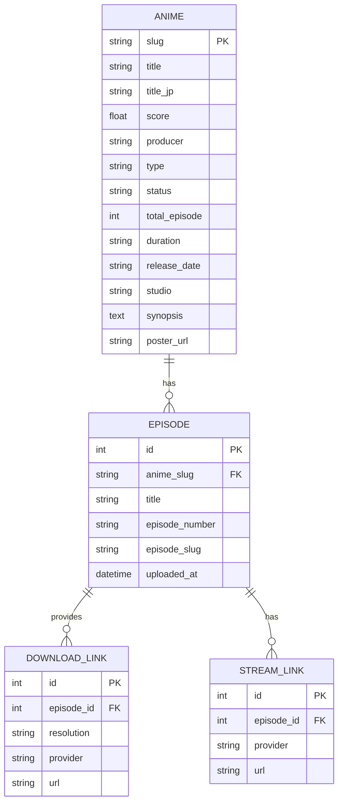

# Rencana Teknis: Platform Streaming Anime (Scraper Otakudesu)

Dokumen ini merinci rencana arsitektur dan strategi implementasi untuk membangun platform streaming anime yang mengambil data dari `otakudesu.best`.

## 1. Strategi Scraping & Ekstraksi Data

### Teknologi yang Digunakan
- **Python 3.10+**
- **httpx**: Untuk HTTP request asinkron dengan dukungan HTTP/2.
- **selectolax**: Untuk parsing HTML yang jauh lebih cepat dibandingkan BeautifulSoup.

### Alur Ekstraksi Metadata
1.  **Crawl Daftar Anime**: Mengambil daftar anime dari halaman `Anime List` atau `On-going Anime`.
2.  **Detail Anime**: Ekstraksi metadata dari halaman detail:
    - Judul, Japanese Title, Skor, Produser, Tipe, Status, Total Episode, Durasi, Tanggal Rilis, Studio, Genre.
    - Poster Image URL.
    - Sinopsis.
3.  **Episode Mapping**: Mengambil daftar link episode dari halaman detail.

### Penanganan Link Embed & Download
- **Embed Streaming**: Ekstraksi URL dari iframe atau elemen video player.
- **Mirror Download**: Ekstraksi link dari berbagai penyedia (misalnya: Sendcm, Mirror, Gdrive) dengan resolusi berbeda (360p, 480p, 720p).
- **Proteksi Cloudflare/Bypass**:
    - Penggunaan header `User-Agent` yang realistis.
    - Implementasi `httpx.AsyncClient` dengan cookies management.
    - Jika diperlukan, integrasi dengan `Undetected Chromedriver` atau `Playwright` khusus untuk bypass tantangan JS awal.

## 2. Desain Database (MySql)

Skema relasional untuk efisiensi penyimpanan dan query:

## 3. Arsitektur Backend (FastAPI)

Menggunakan FastAPI untuk performa tinggi dan dokumentasi otomatis.

### Struktur Proyek
- `app/api/`: Endpoint untuk frontend (search, detail, stream).
- `app/scraper/`: Logika scraping menggunakan `selectolax` dan `httpx`.
- `app/models/`: Definisi model database (SQLAlchemy/SQLModel).
- `app/core/`: Konfigurasi dan utilitas.

### Fitur Utama
- **Asynchronous Processing**: Semua request I/O (database & scraping) dilakukan secara asinkron.
- **Caching**: Implementasi Redis atau in-memory cache untuk hasil scraping halaman depan agar tidak membebani target site.

## 4. Otomasi & Deployment

### Task Scheduler
- Menggunakan **APScheduler** dalam FastAPI atau **Celery** untuk tugas berkala.
- **Update On-going**: Melakukan pengecekan halaman `On-going` setiap 30-60 menit untuk mendeteksi episode baru.

### Deployment Strategi
- **Docker**: Containerization untuk backend dan database.
- **Reverse Proxy**: Nginx untuk handling SSL dan load balancing.

---
*Dibuat oleh Kilo Code - Senior Full-Stack Developer*